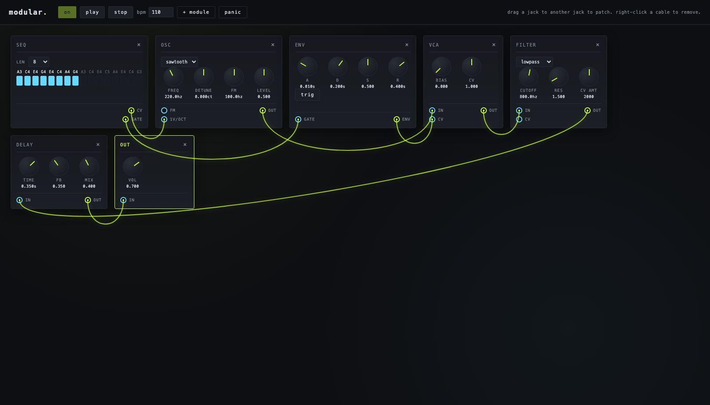

# modular-synth

A browser-based modular synthesizer built with the Web Audio API. Minimal, stylish UI — patch cables, knobs, and a 16-step sequencer.



## modules

oscillator · filter · vca · envelope · lfo · noise · delay · reverb · mixer · scope · keyboard · sequencer · output

## run

```sh
npm install
npm run dev
```

Then open the printed URL, click **power**, and start patching. Drag a jack to another jack to connect; right-click a cable to remove it.

## license

MIT
